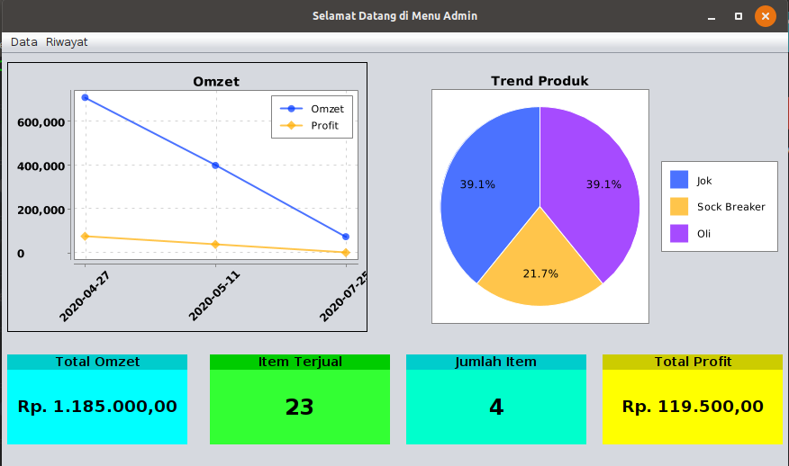
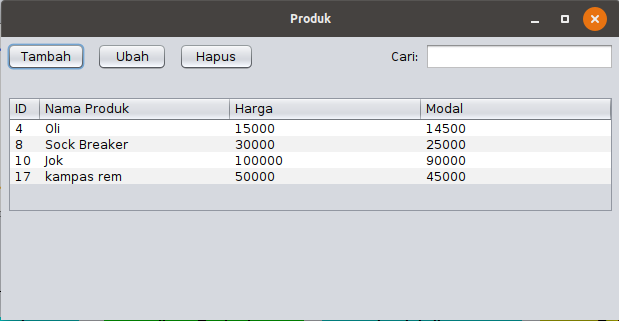

# Aplikasi Bengkel

## 1. Deskripsi Aplikasi

Aplikasi bengkel ini merupakan sebuah aplikasi sederhana yang merupakan sebuah digitalisasi dari proses yang biasa dilakukan pada sebuah bengkel. Terdapat dua pihak yang dapat menggunakan aplikasi ini yaitu, pihak admin dan user. Admin akan dapat melakukan manajemen terhadap user, produk, dan jasa service yang dimiliki oleh bengkel tersebut. User dalam hal ini merupakan pegawai pada bengkel dapat menggunakan aplikasi ini untuk kegiatan transaksi dengan pembeli dan melakukan cetak struk.

## 2. Fitur
- Login
    
    Fitur login ini merupakan halaman awal dari Aplikasi Bengkel, terdapat dua pilihan login yaitu sebagai admin atau user. Pada login pengguna harus memasukkan username dan password yang telah dimiliki

- Sebagai Admin
    
    Pada halaman awal, akan ditunjukkan grafik penjualan produk spare parts. Admin memiliki beberapa pilihan pada menu yang dapat dikelompokkan sebagai berikut:

    - Manajemen user 

        Pada manajemen user ini, admin dapat melihat daftar user, melakukan penambahan user, baik sebagai admin ataupun user biasa, dan admin dapat menghapus user yang sudah ada.

    - Manajemen Produk

        Manajemen produk meliputi menu produk dan menu transaksi produk. Pada menu produk admin dapat melihat list produk, menambah produk, mengubah isi dari list tersebut, dan menghapus isi dari produk. Pada riwayat transaksi, dapat dilihat transaksi apa saja yang telah dilakukan oleh user mengenai penjualan produk.

    - Manajemen Service

        Sama halnya seperti pada manajemen produk, manajemen service terdiri dari menu service dan menu transaksi service. Pada menu service dapat melihat, menambah, mengedit, dan menghapus isi dari tabel service. Sedangkan, pada transaksi adalah dilihat transaksi apa saja yang telah dilakukan oleh user mengenai penjualan service.

- Sebagai User
    - Transaksi Produk

        Pada transaksi produk ini, user dapat melakukan proses transaksi produk. User dapat memilih produk mana saja yang dibeli, kemudian dapat melihat jumlah total harga dan memasukkan jumlah uang pembayaran. Setelah transaksi produk selesai akan diberikan struk dari transaksi yang telah dijalankan.

    - Transaksi Service

        Pada transaksi service, user dapat melakukan input pada menu dari apa saja service yang telah dilakukan. Berbeda dengan transaksi  produk, uang pembayaran dan kembalian tidak disertakan pada struk, karena struk ini nantinya akan diberikan pada costumer yang membawa kendaraannya di bengkel untuk seervice. Nantinya struk ini akan dibawa kembali saat akan mengambil motor sesuai dengan no servicenya. Sehingga pembayaran akan dilakukan dengan manual.

## 3. Petunjuk Penggunaan

#### keterangan
    - username: admin
    - pw: admin123
    - username: user
    - pw:user123

- Sebagai Admin

    1. Login

        Pada halaman login, pengguna harus memasukkan username dan password. Selain itu perlu diperhatikan pula pilihan user yang diberikan, pilih admin apabila ingin login sebagai admin seperti pada gambar.

        

    2. Halaman Awal

        Pada halaman awal akan terlihat grafik dan diagram, selain itu terdapat pilihan pada menu yaitu Data dan Riwayat. Pada data terdapat pilihan user, produk dan service. Pada riwayat, terdapat riwayat transaksi produk dan service.

        

    3. Menu Produk

        Pada produk akan terlihat tabel yang memuat. Admin dapat menambah isi dari tabel tersebut dengan menekan tombol tambah. Akan muncul jendela baru dimana admin harus memasukkan data seperti nama produk, harga, serta modal. Apabila admin ingin merubah isi tabel dapat dilakukan dengan memilih salah satu isi yang ingin diubah kemudan tekan tombol ubah. Untuk menghapus sebuah produk dari isi tabel dapat dilakukan dengan memilih salah satu produk lalu menekan tombol hapus.

        

    4. Menu User
        
        Seperti pada menu produk, admin dapat menambah, mengubah, dan menghapus akun baik sebagai admin maupun user. Saat menambah user admin akan memasukkan username, password, dan kedudukan dari akun yang baru ditambahkan apakah sebagai admin atau user.

        

    5. Menu Service

        Pada menu service fitur yang diberikan sama dengan pada produk, demikian pula dengan mekanisme penggunaannya. Perbedaanya hanya terdapat pada tabel yang tidak memuat modal.

        

    6. Riwayat Transaksi Service

        Halaman ini dilakukan untuk melihat riwayat transaksi dengan memasukkan tanggal awal hingga tanggal akhir dari transaksi. kemudian tekan tombol tampilkan, transaksi yang telah terjadi akan muncul pada tabel.

        

    7. Riwayat Transaksi Produk

        Cara penggunaan dan keterangan serupa dengan riwayat transaksi service.

        


- Sebagai User

    1. Login Sebagai User

        Pada halaman login, pengguna harus memasukkan username dan password. Selain itu perlu diperhatikan pula pilihan user yang diberikan, pilih user apabila ingin login sebagai user seperti pada gambar.

        

    2. Menu

        Pada menu user ini terdapat dua pilihan yaitu Spare part dan servis.

        


    3. Spare Part

        Pada menu spare part ini dilakukan transaksi pembelian produk. Input menu yang dibeli dengan menekan menu nama item pada tabel bagian kanan dua kali. Kemudian akan muncul jendela baru yang menanyakan jumlah itetm, masukkan sesuai pembelian. Kemudian pada bagian kiri akan terlihat jumlah total harga yang hars dibayarkan. Masukkan nominal yang dibayarkan pengunjung pada bagian "dibayar" kemudian enter. Struk transaksi akan tercetak setelah itu.

        

    4. Servis

        Angka pada nomor service akan secara otomatis keluar dan akan berbeda beda tiap transaksinya. pilih service yang dilakukan pada menu dropdown, lalu tekan sesuai yang diinginkan. Masukkan jumlah dan pilih salah satu keterangan diskon. setelah selesai klik cetak.

        


## 4. Keamanan
1. Penggunaan hashing password dengan SHA-256.
2. Melakukan akses kontrol user dan admin.
3. Penggunaan prepared statement untuk mencegah SQL Injection.
4. Penerapan sanitasi input agar aplikasi tidak menampilkan data yang tidak sesuai.

## 5. Library yang Digunakan dalam pembuatan aplikasi

1. Java 8
2. MySQL JDBC Driver
3. LGoodDatePicker-10.4.1
4. xchart-3.6.3
5. jcalendar-1.4
6. jdatepicker-1.3.4
7. jasperreports-6.3.0
8. groovy-2.4.15
9. commons-logging-1.2
10. commons-digester-2.1
11. commons-collections-3.2.1
12. commons-beanutils-1.8.0


## 6. Instalasi

#### Windows 

    1. Pastikan windows sudah memiliki XAMPP, apabila belum maka dapat menginstalnya terlebih dahulu.

    2. Setelah itu klik installer aplikasi pada windows.

        

    3. Maka akan keluar halaman untuk melakukan instalansi dan menuliskan nama folder yang akan digunakan untuk menyimpan hasil instalansi.

        

   4.  Klik "next" untuk menjalankan.

        

    5. Setelah itu, akan muncul halaman untuk memasukkan username DB SQL dan passwordnya. Apabila DB SQL pengguna tidak memiliki password, maka tidak perlu diisi.

        

    6. Klik finish, maka aplikasi sudah terinstal.

        

    Selanjutnya menjalankan hasil instalansi sesuai dengan nama folder yang dibuat sebelumnya.

#### Linux 

    1. Buka file yang berisi installer aplikasi, setelah itu buka terminal untuk melakukan proses instalansi dan jalankan perintah:

        ```
         sudo chmod u+x MechApp_unix_1_0_0.sh 
        ```
    2. Setelah itu jalankan installer:

        ```
        ./MechApp_unix_1_0_0.sh 
        ```

    3. Maka akan muncul halaman untuk instalansi, seperti dibawah ini:

        

    4. Klik next untuk melanjutkan proses instalansi, setelah itu akan muuncul halaman untuk menentukan nama folder yang akan digunakan:

        

    5. Setelah itu, akan muncul halaman untuk memasukkan username DB SQL dan passwordnya. Apabila DB SQL pengguna tidak memiliki password, maka tidak perlu diisi.

        

    6. Klik "next" untuk langkah terakhir penginstalan.

        


    7. Terdapat cara lain juga dengan membuka folder sesuai dengan nama folder yang sudah dibuat sebelumnya dan jalankan perintah:

        ```
        java -jar AplikasiBengkel.jar 
        ```

    8. Maka akan muncul tampilan seperti di bawah ini

        
